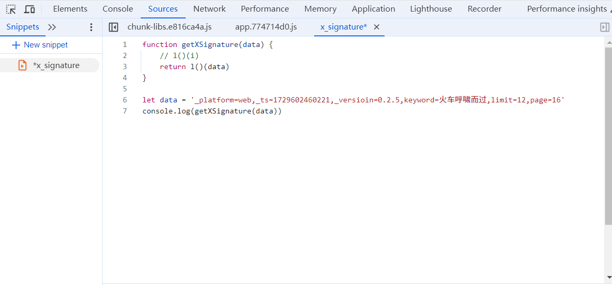

js逆向的两种方式：

1.使用第三方js库，比如md5这种

使用node.js下载第三方库

例如：npm install crypto-js

```javascript
const CryptoJS = require("crypto-js")
console.log(CryptoJS.MD5('afengafeng').toString())
```


2.把调试的js代码在浏览器中运行，修修改改，然后把js代码放入自己的项目中

搭架子



运行以上代码，会报错，然后依次解决错误，直到这个js代码能跑出结果

