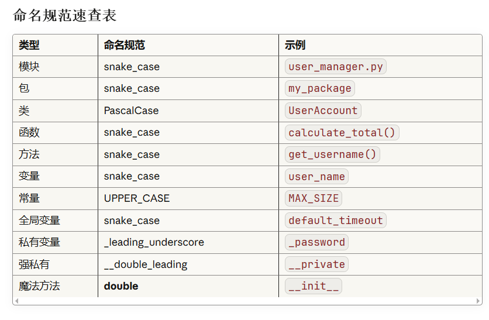

# Python自学完整手册

## 目录

1. [Python入门](https://claude.ai/chat/6d2412cb-2a32-45fd-9b50-cde649941db9#python入门)
2. [基础数据类型](https://claude.ai/chat/6d2412cb-2a32-45fd-9b50-cde649941db9#基础数据类型)
3. [控制流程](https://claude.ai/chat/6d2412cb-2a32-45fd-9b50-cde649941db9#控制流程)
4. [函数](https://claude.ai/chat/6d2412cb-2a32-45fd-9b50-cde649941db9#函数)
5. [数据结构](https://claude.ai/chat/6d2412cb-2a32-45fd-9b50-cde649941db9#数据结构)
6. [面向对象编程](https://claude.ai/chat/6d2412cb-2a32-45fd-9b50-cde649941db9#面向对象编程)
7. [模块和包](https://claude.ai/chat/6d2412cb-2a32-45fd-9b50-cde649941db9#模块和包)
8. [文件操作](https://claude.ai/chat/6d2412cb-2a32-45fd-9b50-cde649941db9#文件操作)
9. [异常处理](https://claude.ai/chat/6d2412cb-2a32-45fd-9b50-cde649941db9#异常处理)
10. [高级特性](https://claude.ai/chat/6d2412cb-2a32-45fd-9b50-cde649941db9#高级特性)
11. [实用库和框架](https://claude.ai/chat/6d2412cb-2a32-45fd-9b50-cde649941db9#实用库和框架)

------

## 学习建议和最佳实践



### 1. 代码风格 (PEP 8)

```python
# 好的命名
user_name = "Alice"  # 变量使用小写+下划线
MAX_SIZE = 100       # 常量使用大写
class UserAccount:   # 类名使用大驼峰
    pass

# 缩进使用4个空格
def calculate_total(items):
    total = 0
    for item in items:
        total += item
    return total

# 空行规则
# 类和函数定义前后空2行
# 方法定义之间空1行

# 导入顺序
import os           # 标准库
import sys

import numpy        # 第三方库
import pandas

from myproject import mymodule  # 本地模块
```

### 2. 调试技巧

```python
# 使用print调试
def calculate(a, b):
    print(f"Debug: a={a}, b={b}")
    result = a + b
    print(f"Debug: result={result}")
    return result

# 使用assert
def divide(a, b):
    assert b != 0, "除数不能为零"
    return a / b

# 使用pdb调试器
import pdb

def buggy_function():
    x = 10
    pdb.set_trace()  # 设置断点
    y = x / 0
    return y

# 使用logging
import logging

logging.basicConfig(level=logging.DEBUG)
logger = logging.getLogger(__name__)

logger.debug("这是调试信息")
logger.info("这是普通信息")
logger.warning("这是警告")
logger.error("这是错误")
```

### 3. 测试

```python
# 使用unittest
import unittest

class TestMathOperations(unittest.TestCase):
    def test_addition(self):
        self.assertEqual(2 + 2, 4)
    
    def test_division(self):
        self.assertEqual(10 / 2, 5)
    
    def test_division_by_zero(self):
        with self.assertRaises(ZeroDivisionError):
            10 / 0

if __name__ == '__main__':
    unittest.main()

# 使用pytest (更简洁)
def add(a, b):
    return a + b

def test_add():
    assert add(2, 3) == 5
    assert add(-1, 1) == 0
```

### 4. 虚拟环境

```bash
# 创建虚拟环境
python -m venv myenv

# 激活虚拟环境
# Windows
myenv\Scripts\activate
# Linux/Mac
source myenv/bin/activate

# 安装包
pip install requests numpy pandas

# 保存依赖
pip freeze > requirements.txt

# 安装依赖
pip install -r requirements.txt

# 退出虚拟环境
deactivate
```

### 5. 常见设计模式

```python
# 单例模式
class Singleton:
    _instance = None
    
    def __new__(cls):
        if cls._instance is None:
            cls._instance = super().__new__(cls)
        return cls._instance

# 工厂模式
class Dog:
    def speak(self):
        return "Woof!"

class Cat:
    def speak(self):
        return "Meow!"

class AnimalFactory:
    @staticmethod
    def create_animal(animal_type):
        if animal_type == "dog":
            return Dog()
        elif animal_type == "cat":
            return Cat()
        else:
            raise ValueError("Unknown animal type")

# 观察者模式
class Subject:
    def __init__(self):
        self._observers = []
    
    def attach(self, observer):
        self._observers.append(observer)
    
    def notify(self, message):
        for observer in self._observers:
            observer.update(message)

class Observer:
    def __init__(self, name):
        self.name = name
    
    def update(self, message):
        print(f"{self.name} received: {message}")

# 使用
subject = Subject()
obs1 = Observer("Observer 1")
obs2 = Observer("Observer 2")
subject.attach(obs1)
subject.attach(obs2)
subject.notify("Hello!")
```

### 6. 性能优化技巧

```python
# 使用列表推导式而非循环
# 慢
result = []
for i in range(1000):
    result.append(i * 2)

# 快
result = [i * 2 for i in range(1000)]

# 使用生成器节省内存
# 慢 - 占用大量内存
def get_numbers(n):
    return [i for i in range(n)]

# 快 - 按需生成
def get_numbers(n):
    for i in range(n):
        yield i

# 使用join而非字符串拼接
# 慢
result = ""
for i in range(1000):
    result += str(i)

# 快
result = "".join(str(i) for i in range(1000))

# 使用set进行查找
# 慢 - O(n)
if item in my_list:
    pass

# 快 - O(1)
if item in my_set:
    pass

# 使用局部变量
def process():
    local_len = len  # 缓存全局函数
    for i in range(1000):
        x = local_len([1, 2, 3])  # 更快
```

### 7. 代码组织结构

```
myproject/
│
├── myproject/           # 项目包
│   ├── __init__.py
│   ├── main.py         # 主程序入口
│   ├── config.py       # 配置文件
│   ├── utils.py        # 工具函数
│   │
│   ├── models/         # 数据模型
│   │   ├── __init__.py
│   │   └── user.py
│   │
│   └── services/       # 业务逻辑
│       ├── __init__.py
│       └── auth.py
│
├── tests/              # 测试文件
│   ├── __init__.py
│   ├── test_utils.py
│   └── test_models.py
│
├── docs/               # 文档
│   └── README.md
│
├── requirements.txt    # 依赖列表
├── setup.py           # 安装配置
└── .gitignore         # Git忽略文件
```

------

## 实战项目示例

### 项目1: 命令行待办事项应用

```python
import json
from datetime import datetime

class TodoApp:
    def __init__(self, filename='todos.json'):
        self.filename = filename
        self.todos = self.load_todos()
    
    def load_todos(self):
        try:
            with open(self.filename, 'r', encoding='utf-8') as f:
                return json.load(f)
        except FileNotFoundError:
            return []
    
    def save_todos(self):
        with open(self.filename, 'w', encoding='utf-8') as f:
            json.dump(self.todos, f, ensure_ascii=False, indent=2)
    
    def add_todo(self, task):
        todo = {
            'id': len(self.todos) + 1,
            'task': task,
            'completed': False,
            'created_at': datetime.now().strftime('%Y-%m-%d %H:%M:%S')
        }
        self.todos.append(todo)
        self.save_todos()
        print(f"✓ 添加任务: {task}")
    
    def list_todos(self):
        if not self.todos:
            print("没有待办事项")
            return
        
        print("\n待办事项列表:")
        print("-" * 50)
        for todo in self.todos:
            status = "✓" if todo['completed'] else "○"
            print(f"{status} [{todo['id']}] {todo['task']}")
        print("-" * 50)
    
    def complete_todo(self, todo_id):
        for todo in self.todos:
            if todo['id'] == todo_id:
                todo['completed'] = True
                self.save_todos()
                print(f"✓ 完成任务: {todo['task']}")
                return
        print(f"未找到ID为{todo_id}的任务")
    
    def delete_todo(self, todo_id):
        for i, todo in enumerate(self.todos):
            if todo['id'] == todo_id:
                task = self.todos.pop(i)['task']
                self.save_todos()
                print(f"✓ 删除任务: {task}")
                return
        print(f"未找到ID为{todo_id}的任务")

def main():
    app = TodoApp()
    
    while True:
        print("\n命令: add, list, complete, delete, quit")
        command = input("输入命令: ").strip().lower()
        
        if command == 'add':
            task = input("输入任务: ")
            app.add_todo(task)
        elif command == 'list':
            app.list_todos()
        elif command == 'complete':
            todo_id = int(input("输入任务ID: "))
            app.complete_todo(todo_id)
        elif command == 'delete':
            todo_id = int(input("输入任务ID: "))
            app.delete_todo(todo_id)
        elif command == 'quit':
            print("再见!")
            break
        else:
            print("无效命令")

if __name__ == '__main__':
    main()
```

### 项目2: 简单的Web爬虫

```python
import requests
from bs4 import BeautifulSoup
import csv
from time import sleep

class WebScraper:
    def __init__(self):
        self.headers = {
            'User-Agent': 'Mozilla/5.0 (Windows NT 10.0; Win64; x64) AppleWebKit/537.36'
        }
    
    def fetch_page(self, url):
        try:
            response = requests.get(url, headers=self.headers, timeout=10)
            response.raise_for_status()
            return response.text
        except requests.RequestException as e:
            print(f"错误: {e}")
            return None
    
    def parse_books(self, html):
        soup = BeautifulSoup(html, 'html.parser')
        books = []
        
        # 假设我们在抓取书籍信息
        for item in soup.find_all('div', class_='book-item'):
            book = {
                'title': item.find('h3').text.strip(),
                'author': item.find('span', class_='author').text.strip(),
                'price': item.find('span', class_='price').text.strip()
            }
            books.append(book)
        
        return books
    
    def save_to_csv(self, data, filename='books.csv'):
        with open(filename, 'w', newline='', encoding='utf-8') as f:
            writer = csv.DictWriter(f, fieldnames=['title', 'author', 'price'])
            writer.writeheader()
            writer.writerows(data)
        print(f"数据已保存到 {filename}")
    
    def scrape(self, urls):
        all_books = []
        
        for url in urls:
            print(f"正在抓取: {url}")
            html = self.fetch_page(url)
            
            if html:
                books = self.parse_books(html)
                all_books.extend(books)
                print(f"找到 {len(books)} 本书")
            
            sleep(1)  # 礼貌延迟
        
        return all_books

# 使用示例
# scraper = WebScraper()
# urls = ['https://example.com/books?page=1']
# books = scraper.scrape(urls)
# scraper.save_to_csv(books)
```

### 项目3: 数据分析脚本

```python
import pandas as pd
import matplotlib.pyplot as plt
import numpy as np

class SalesAnalyzer:
    def __init__(self, data_file):
        self.df = pd.read_csv(data_file)
        self.prepare_data()
    
    def prepare_data(self):
        # 数据清洗
        self.df['date'] = pd.to_datetime(self.df['date'])
        self.df['revenue'] = self.df['quantity'] * self.df['price']
        self.df = self.df.dropna()
    
    def summary_stats(self):
        print("=== 销售数据摘要 ===")
        print(f"总收入: ${self.df['revenue'].sum():,.2f}")
        print(f"总订单数: {len(self.df)}")
        print(f"平均订单金额: ${self.df['revenue'].mean():.2f}")
        print(f"最高单笔: ${self.df['revenue'].max():.2f}")
        print(f"最低单笔: ${self.df['revenue'].min():.2f}")
    
    def monthly_trends(self):
        monthly = self.df.groupby(self.df['date'].dt.to_period('M'))['revenue'].sum()
        
        plt.figure(figsize=(12, 6))
        monthly.plot(kind='bar')
        plt.title('月度销售趋势')
        plt.xlabel('月份')
        plt.ylabel('收入 ($)')
        plt.xticks(rotation=45)
        plt.tight_layout()
        plt.savefig('monthly_trends.png')
        print("图表已保存为 monthly_trends.png")
    
    def top_products(self, n=10):
        top = self.df.groupby('product')['revenue'].sum().nlargest(n)
        
        print(f"\n=== 前{n}名畅销产品 ===")
        for i, (product, revenue) in enumerate(top.items(), 1):
            print(f"{i}. {product}: ${revenue:,.2f}")
        
        plt.figure(figsize=(10, 6))
        top.plot(kind='barh')
        plt.title(f'前{n}名畅销产品')
        plt.xlabel('收入 ($)')
        plt.tight_layout()
        plt.savefig('top_products.png')
    
    def customer_segmentation(self):
        customer_stats = self.df.groupby('customer_id').agg({
            'revenue': 'sum',
            'order_id': 'count'
        }).rename(columns={'order_id': 'order_count'})
        
        # RFM分析
        customer_stats['avg_order'] = customer_stats['revenue'] / customer_stats['order_count']
        
        # 客户分级
        customer_stats['segment'] = pd.cut(
            customer_stats['revenue'],
            bins=[0, 100, 500, 1000, float('inf')],
            labels=['Bronze', 'Silver', 'Gold', 'Platinum']
        )
        
        print("\n=== 客户分级统计 ===")
        print(customer_stats['segment'].value_counts())
        
        return customer_stats
    
    def generate_report(self):
        print("\n" + "="*50)
        print("销售数据分析报告")
        print("="*50 + "\n")
        
        self.summary_stats()
        self.top_products()
        self.customer_segmentation()
        self.monthly_trends()
        
        print("\n报告生成完成!")

# 使用示例
# analyzer = SalesAnalyzer('sales_data.csv')
# analyzer.generate_report()
```

------

## 学习资源推荐

### 在线资源

1. **官方文档**: https://docs.python.org/zh-cn/3/
2. **Python教程**: https://www.runoob.com/python3/
3. **LeetCode**: 练习算法和数据结构
4. **Real Python**: https://realpython.com/

### 推荐书籍

1. 《Python编程:从入门到实践》
2. 《流畅的Python》
3. 《Effective Python》
4. 《Python Cookbook》

### 学习路径建议

**第1-2周: 基础语法**

- 数据类型、变量、运算符
- 控制流程(if、for、while)
- 函数基础
- 每天练习1-2小时

**第3-4周: 数据结构**

- 列表、元组、字典、集合
- 字符串操作
- 文件读写
- 完成3-5个小项目

**第5-6周: 面向对象**

- 类和对象
- 继承和多态
- 特殊方法
- 开发一个小型应用

**第7-8周: 高级特性**

- 装饰器、生成器
- 异常处理
- 模块和包
- 参与开源项目

**第9周以后: 专业方向**

- Web开发: Flask/Django
- 数据科学: NumPy/Pandas/Matplotlib
- 自动化: Selenium/Scrapy
- 机器学习: Scikit-learn/TensorFlow

### 练习建议

1. 每天编写代码,保持手感
2. 阅读优秀的开源代码
3. 参与代码审查和讨论
4. 做项目而不仅仅是学教程
5. 加入Python社区,与他人交流

------

## 常见问题FAQ

**Q: Python 2和Python 3有什么区别?** A: Python 3是未来,已停止对Python 2的支持。主要区别包括print函数、整数除法、Unicode支持等。建议直接学习Python 3。

**Q: 如何选择IDE?** A: 初学者推荐VS Code、PyCharm Community。熟练后可以根据项目需求选择专业工具。

**Q: 学习Python需要多长时间?** A: 基础语法1-2个月,熟练应用需要6-12个月持续练习。关键是坚持和实践。

**Q: Python适合做什么?** A: Web开发、数据分析、机器学习、自动化脚本、爬虫、科学计算等。不适合移动应用开发和性能要求极高的场景。

**Q: 如何提高代码质量?** A: 遵循PEP 8规范、编写测试、使用类型注解、代码审查、重构、学习设计模式。

------

## 结语

Python是一门优雅而强大的编程语言,学习Python不仅是掌握一门技术,更是培养编程思维和解决问题的能力。记住:

- **多写代码**: 实践是最好的老师
- **多看代码**: 学习优秀的开源项目
- **多思考**: 理解原理而不是死记硬背
- **多分享**: 教别人也是学习的过程
- **保持耐心**: 编程能力需要时间积累

祝你在Python学习之路上越走越远!

------

*本手册持续更新中,欢迎提出建议和反馈*

## Python入门

### 安装Python

访问 [python.org](https://python.org/) 下载并安装最新版本的Python(推荐Python 3.8+)。

### 第一个程序

```python
print("Hello, World!")
```

### Python解释器

- 交互式模式:在终端输入 `python` 或 `python3`
- 脚本模式:创建 `.py` 文件并运行 `python filename.py`

------

## 基础数据类型

### 1. 数字类型

#### 整数 (int)

```python
x = 10
y = -5
z = 0
```

#### 浮点数 (float)

```python
pi = 3.14
e = 2.718
```

#### 复数 (complex)

```python
c = 3 + 4j
```

#### 基本运算

```python
# 加减乘除
a = 10 + 5    # 15
b = 10 - 5    # 5
c = 10 * 5    # 50
d = 10 / 5    # 2.0 (总是返回浮点数)

# 整除和取余
e = 10 // 3   # 3
f = 10 % 3    # 1

# 幂运算
g = 2 ** 3    # 8
```

### 2. 字符串 (str)

```python
# 创建字符串
s1 = "Hello"
s2 = 'World'
s3 = """多行
字符串"""

# 字符串操作
text = "Python"
print(text[0])        # 'P' (索引)
print(text[-1])       # 'n' (负索引)
print(text[0:3])      # 'Pyt' (切片)
print(text.upper())   # 'PYTHON'
print(text.lower())   # 'python'
print(len(text))      # 6

# 字符串拼接
greeting = "Hello" + " " + "World"
repeated = "Ha" * 3   # "HaHaHa"

# 字符串格式化
name = "Alice"
age = 25
# f-string (推荐)
msg = f"My name is {name}, I'm {age} years old"
# format方法
msg = "My name is {}, I'm {} years old".format(name, age)
# 旧式格式化
msg = "My name is %s, I'm %d years old" % (name, age)

# 常用字符串方法
s = "  hello world  "
print(s.strip())           # "hello world" (去除空格)
print(s.split())           # ['hello', 'world']
print(s.replace("world", "Python"))  # "  hello Python  "
print(s.startswith("  h")) # True
print(s.endswith("d  "))   # True
```

### 3. 布尔类型 (bool)

```python
is_valid = True
is_empty = False

# 布尔运算
print(True and False)  # False
print(True or False)   # True
print(not True)        # False

# 比较运算
print(5 > 3)   # True
print(5 == 5)  # True
print(5 != 3)  # True
```

### 4. None类型

```python
result = None  # 表示"空"或"无值"

if result is None:
    print("No result")
```

------

## 控制流程

### 1. 条件语句

```python
# if语句
age = 18
if age >= 18:
    print("成年人")
elif age >= 13:
    print("青少年")
else:
    print("儿童")

# 三元运算符
status = "成年" if age >= 18 else "未成年"
```

### 2. 循环语句

#### for循环

```python
# 遍历列表
fruits = ["apple", "banana", "cherry"]
for fruit in fruits:
    print(fruit)

# 使用range
for i in range(5):      # 0, 1, 2, 3, 4
    print(i)

for i in range(2, 10, 2):  # 2, 4, 6, 8
    print(i)

# enumerate获取索引和值
for index, fruit in enumerate(fruits):
    print(f"{index}: {fruit}")
```

#### while循环

```python
count = 0
while count < 5:
    print(count)
    count += 1

# 无限循环
while True:
    user_input = input("输入'quit'退出: ")
    if user_input == 'quit':
        break
```

### 3. 控制语句

```python
# break: 跳出循环
for i in range(10):
    if i == 5:
        break
    print(i)

# continue: 跳过当前迭代
for i in range(10):
    if i % 2 == 0:
        continue
    print(i)  # 只打印奇数

# pass: 占位符
for i in range(5):
    pass  # 什么都不做
```

------

## 函数

### 1. 定义和调用函数

```python
# 基本函数
def greet(name):
    return f"Hello, {name}!"

result = greet("Alice")
print(result)  # "Hello, Alice!"

# 多个参数
def add(a, b):
    return a + b

# 默认参数
def greet(name, greeting="Hello"):
    return f"{greeting}, {name}!"

print(greet("Bob"))              # "Hello, Bob!"
print(greet("Bob", "Hi"))        # "Hi, Bob!"

# 关键字参数
def describe_pet(animal, name):
    print(f"I have a {animal} named {name}")

describe_pet(name="Buddy", animal="dog")
```

### 2. 可变参数

```python
# *args: 接收任意数量的位置参数
def sum_all(*numbers):
    return sum(numbers)

print(sum_all(1, 2, 3, 4, 5))  # 15

# **kwargs: 接收任意数量的关键字参数
def print_info(**info):
    for key, value in info.items():
        print(f"{key}: {value}")

print_info(name="Alice", age=25, city="Beijing")
```

### 3. Lambda函数

```python
# 匿名函数
square = lambda x: x ** 2
print(square(5))  # 25

# 常用于高阶函数
numbers = [1, 2, 3, 4, 5]
squared = list(map(lambda x: x ** 2, numbers))
print(squared)  # [1, 4, 9, 16, 25]
```

### 4. 函数文档

```python
def calculate_area(radius):
    """
    计算圆的面积
    
    参数:
        radius: 圆的半径
    
    返回:
        圆的面积
    """
    return 3.14159 * radius ** 2

# 查看文档
print(calculate_area.__doc__)
```

------

## 数据结构

### 1. 列表 (List)

```python
# 创建列表
fruits = ["apple", "banana", "cherry"]
numbers = [1, 2, 3, 4, 5]
mixed = [1, "hello", 3.14, True]

# 访问元素
print(fruits[0])      # "apple"
print(fruits[-1])     # "cherry"
print(fruits[0:2])    # ["apple", "banana"]

# 修改列表
fruits[0] = "orange"
fruits.append("grape")        # 添加元素
fruits.insert(1, "mango")     # 在指定位置插入
fruits.remove("banana")       # 删除指定元素
popped = fruits.pop()         # 删除并返回最后一个元素
fruits.pop(0)                 # 删除指定索引的元素

# 列表操作
print(len(fruits))            # 长度
print("apple" in fruits)      # 检查元素是否存在
fruits.sort()                 # 排序
fruits.reverse()              # 反转
fruits.clear()                # 清空

# 列表推导式
squares = [x ** 2 for x in range(10)]
evens = [x for x in range(20) if x % 2 == 0]
```

### 2. 元组 (Tuple)

```python
# 创建元组(不可变)
point = (3, 4)
colors = ("red", "green", "blue")

# 访问元素
print(point[0])  # 3

# 元组解包
x, y = point
print(x, y)  # 3 4

# 单元素元组
single = (1,)  # 注意逗号
```

### 3. 字典 (Dictionary)

```python
# 创建字典
person = {
    "name": "Alice",
    "age": 25,
    "city": "Beijing"
}

# 访问元素
print(person["name"])           # "Alice"
print(person.get("age"))        # 25
print(person.get("job", "N/A")) # 如果不存在返回默认值

# 修改字典
person["age"] = 26              # 修改
person["job"] = "Engineer"      # 添加
del person["city"]              # 删除
removed_value = person.pop("job")  # 删除并返回值

# 字典操作
print(person.keys())            # 所有键
print(person.values())          # 所有值
print(person.items())           # 所有键值对

# 遍历字典
for key, value in person.items():
    print(f"{key}: {value}")

# 字典推导式
squares = {x: x**2 for x in range(5)}
# {0: 0, 1: 1, 2: 4, 3: 9, 4: 16}
```

### 4. 集合 (Set)

```python
# 创建集合(无序、不重复)
fruits = {"apple", "banana", "cherry"}
numbers = set([1, 2, 3, 2, 1])  # {1, 2, 3}

# 集合操作
fruits.add("orange")
fruits.remove("banana")
fruits.discard("grape")  # 不存在也不会报错

# 集合运算
a = {1, 2, 3, 4}
b = {3, 4, 5, 6}

print(a | b)  # 并集: {1, 2, 3, 4, 5, 6}
print(a & b)  # 交集: {3, 4}
print(a - b)  # 差集: {1, 2}
print(a ^ b)  # 对称差: {1, 2, 5, 6}

# 集合推导式
squares = {x**2 for x in range(5)}
```

------

## 面向对象编程

### 1. 类的定义

```python
class Dog:
    # 类属性
    species = "Canis familiaris"
    
    # 构造函数
    def __init__(self, name, age):
        # 实例属性
        self.name = name
        self.age = age
    
    # 实例方法
    def bark(self):
        return f"{self.name} says Woof!"
    
    def get_info(self):
        return f"{self.name} is {self.age} years old"

# 创建对象
dog1 = Dog("Buddy", 3)
dog2 = Dog("Max", 5)

print(dog1.bark())      # "Buddy says Woof!"
print(dog2.get_info())  # "Max is 5 years old"
```

### 2. 继承

```python
# 父类
class Animal:
    def __init__(self, name):
        self.name = name
    
    def speak(self):
        pass

# 子类
class Cat(Animal):
    def speak(self):
        return f"{self.name} says Meow!"

class Dog(Animal):
    def speak(self):
        return f"{self.name} says Woof!"

# 使用
cat = Cat("Whiskers")
dog = Dog("Buddy")
print(cat.speak())  # "Whiskers says Meow!"
print(dog.speak())  # "Buddy says Woof!"
```

### 3. 封装

```python
class BankAccount:
    def __init__(self, owner, balance=0):
        self.owner = owner
        self.__balance = balance  # 私有属性
    
    def deposit(self, amount):
        if amount > 0:
            self.__balance += amount
            return True
        return False
    
    def withdraw(self, amount):
        if 0 < amount <= self.__balance:
            self.__balance -= amount
            return True
        return False
    
    def get_balance(self):
        return self.__balance

account = BankAccount("Alice", 1000)
account.deposit(500)
print(account.get_balance())  # 1500
```

### 4. 多态

```python
class Shape:
    def area(self):
        pass

class Rectangle(Shape):
    def __init__(self, width, height):
        self.width = width
        self.height = height
    
    def area(self):
        return self.width * self.height

class Circle(Shape):
    def __init__(self, radius):
        self.radius = radius
    
    def area(self):
        return 3.14159 * self.radius ** 2

# 多态使用
shapes = [Rectangle(5, 10), Circle(7)]
for shape in shapes:
    print(f"Area: {shape.area()}")
```

### 5. 特殊方法(魔法方法)

```python
class Point:
    def __init__(self, x, y):
        self.x = x
        self.y = y
    
    # 字符串表示
    def __str__(self):
        return f"Point({self.x}, {self.y})"
    
    # 开发者表示
    def __repr__(self):
        return f"Point(x={self.x}, y={self.y})"
    
    # 加法运算
    def __add__(self, other):
        return Point(self.x + other.x, self.y + other.y)
    
    # 相等比较
    def __eq__(self, other):
        return self.x == other.x and self.y == other.y
    
    # 长度
    def __len__(self):
        return int((self.x**2 + self.y**2)**0.5)

p1 = Point(1, 2)
p2 = Point(3, 4)
print(p1)           # "Point(1, 2)"
print(p1 + p2)      # "Point(4, 6)"
print(p1 == p2)     # False
```

### 6. 属性装饰器

```python
class Temperature:
    def __init__(self, celsius):
        self._celsius = celsius
    
    @property
    def celsius(self):
        return self._celsius
    
    @celsius.setter
    def celsius(self, value):
        if value < -273.15:
            raise ValueError("温度不能低于绝对零度")
        self._celsius = value
    
    @property
    def fahrenheit(self):
        return self._celsius * 9/5 + 32

temp = Temperature(25)
print(temp.celsius)      # 25
print(temp.fahrenheit)   # 77.0
temp.celsius = 30        # 使用setter
```

### 7. 类方法和静态方法

```python
class MathOperations:
    pi = 3.14159
    
    @classmethod
    def circle_area(cls, radius):
        return cls.pi * radius ** 2
    
    @staticmethod
    def add(a, b):
        return a + b

# 使用
print(MathOperations.circle_area(5))  # 78.53975
print(MathOperations.add(3, 4))       # 7
```

------

## 模块和包

### 1. 导入模块

```python
# 导入整个模块
import math
print(math.sqrt(16))  # 4.0

# 导入特定函数
from math import sqrt, pi
print(sqrt(16))       # 4.0
print(pi)             # 3.141592653589793

# 导入并重命名
import numpy as np
from math import sqrt as square_root

# 导入所有(不推荐)
from math import *
```

### 2. 创建模块

创建文件 `mymodule.py`:

```python
# mymodule.py
def greet(name):
    return f"Hello, {name}!"

PI = 3.14159

class Calculator:
    @staticmethod
    def add(a, b):
        return a + b
```

使用模块:

```python
import mymodule

print(mymodule.greet("Alice"))
print(mymodule.PI)
calc = mymodule.Calculator()
print(calc.add(5, 3))
```

### 3. 包结构

```
mypackage/
    __init__.py
    module1.py
    module2.py
    subpackage/
        __init__.py
        module3.py
```

使用包:

```python
from mypackage import module1
from mypackage.subpackage import module3
```

------

## 文件操作

### 1. 读取文件

```python
# 基本读取
with open('file.txt', 'r', encoding='utf-8') as f:
    content = f.read()
    print(content)

# 逐行读取
with open('file.txt', 'r', encoding='utf-8') as f:
    for line in f:
        print(line.strip())

# 读取所有行到列表
with open('file.txt', 'r', encoding='utf-8') as f:
    lines = f.readlines()
```

### 2. 写入文件

```python
# 写入(覆盖)
with open('output.txt', 'w', encoding='utf-8') as f:
    f.write("Hello, World!\n")
    f.write("Python is awesome!")

# 追加
with open('output.txt', 'a', encoding='utf-8') as f:
    f.write("\nNew line")

# 写入多行
lines = ["Line 1\n", "Line 2\n", "Line 3\n"]
with open('output.txt', 'w', encoding='utf-8') as f:
    f.writelines(lines)
```

### 3. 文件和目录操作

```python
import os

# 检查文件是否存在
if os.path.exists('file.txt'):
    print("File exists")

# 获取文件信息
print(os.path.getsize('file.txt'))  # 文件大小
print(os.path.isfile('file.txt'))   # 是否是文件
print(os.path.isdir('folder'))      # 是否是目录

# 目录操作
os.mkdir('new_folder')              # 创建目录
os.makedirs('path/to/folder')       # 创建多级目录
os.remove('file.txt')               # 删除文件
os.rmdir('folder')                  # 删除空目录
os.listdir('.')                     # 列出目录内容

# 路径操作
from pathlib import Path

path = Path('folder/file.txt')
print(path.exists())
print(path.name)        # 'file.txt'
print(path.parent)      # 'folder'
print(path.suffix)      # '.txt'
```

------

## 异常处理

### 1. 基本异常处理

```python
try:
    result = 10 / 0
except ZeroDivisionError:
    print("不能除以零!")

# 处理多个异常
try:
    number = int(input("输入一个数字: "))
    result = 10 / number
except ValueError:
    print("无效的输入!")
except ZeroDivisionError:
    print("不能除以零!")
```

### 2. else和finally

```python
try:
    file = open('data.txt', 'r')
    data = file.read()
except FileNotFoundError:
    print("文件不存在")
else:
    # 如果没有异常则执行
    print("文件读取成功")
finally:
    # 无论是否有异常都执行
    print("清理资源")
    if 'file' in locals():
        file.close()
```

### 3. 抛出异常

```python
def divide(a, b):
    if b == 0:
        raise ValueError("除数不能为零")
    return a / b

try:
    result = divide(10, 0)
except ValueError as e:
    print(f"错误: {e}")
```

### 4. 自定义异常

```python
class InsufficientFundsError(Exception):
    def __init__(self, balance, amount):
        self.balance = balance
        self.amount = amount
        super().__init__(f"余额不足: 当前{balance}, 需要{amount}")

def withdraw(balance, amount):
    if amount > balance:
        raise InsufficientFundsError(balance, amount)
    return balance - amount

try:
    new_balance = withdraw(100, 150)
except InsufficientFundsError as e:
    print(e)
```

------

## 高级特性

### 1. 迭代器和生成器

```python
# 迭代器
class CountDown:
    def __init__(self, start):
        self.current = start
    
    def __iter__(self):
        return self
    
    def __next__(self):
        if self.current <= 0:
            raise StopIteration
        self.current -= 1
        return self.current + 1

for num in CountDown(5):
    print(num)  # 5, 4, 3, 2, 1

# 生成器函数
def fibonacci(n):
    a, b = 0, 1
    for _ in range(n):
        yield a
        a, b = b, a + b

for num in fibonacci(10):
    print(num, end=' ')  # 0 1 1 2 3 5 8 13 21 34

# 生成器表达式
squares = (x**2 for x in range(10))
print(list(squares))  # [0, 1, 4, 9, 16, 25, 36, 49, 64, 81]
```

### 2. 装饰器

```python
# 函数装饰器
def timer(func):
    import time
    def wrapper(*args, **kwargs):
        start = time.time()
        result = func(*args, **kwargs)
        end = time.time()
        print(f"{func.__name__} took {end-start:.4f} seconds")
        return result
    return wrapper

@timer
def slow_function():
    import time
    time.sleep(1)
    return "Done"

slow_function()

# 带参数的装饰器
def repeat(times):
    def decorator(func):
        def wrapper(*args, **kwargs):
            for _ in range(times):
                result = func(*args, **kwargs)
            return result
        return wrapper
    return decorator

@repeat(3)
def greet(name):
    print(f"Hello, {name}!")

greet("Alice")  # 打印3次
```

### 3. 上下文管理器

```python
# 使用with语句
with open('file.txt', 'r') as f:
    data = f.read()
# 文件自动关闭

# 自定义上下文管理器
class FileManager:
    def __init__(self, filename, mode):
        self.filename = filename
        self.mode = mode
        self.file = None
    
    def __enter__(self):
        self.file = open(self.filename, self.mode)
        return self.file
    
    def __exit__(self, exc_type, exc_val, exc_tb):
        if self.file:
            self.file.close()

with FileManager('test.txt', 'w') as f:
    f.write('Hello')

# 使用contextlib
from contextlib import contextmanager

@contextmanager
def file_manager(filename, mode):
    f = open(filename, mode)
    try:
        yield f
    finally:
        f.close()

with file_manager('test.txt', 'r') as f:
    print(f.read())
```

### 4. 类型注解

```python
from typing import List, Dict, Optional, Union

def greet(name: str) -> str:
    return f"Hello, {name}!"

def process_items(items: List[int]) -> int:
    return sum(items)

def get_user(user_id: int) -> Optional[Dict[str, str]]:
    # 返回字典或None
    if user_id == 1:
        return {"name": "Alice", "email": "alice@example.com"}
    return None

def parse_value(value: Union[int, str]) -> int:
    if isinstance(value, str):
        return int(value)
    return value
```

### 5. 列表、字典、集合高级操作

```python
# zip函数
names = ["Alice", "Bob", "Charlie"]
scores = [85, 90, 95]
for name, score in zip(names, scores):
    print(f"{name}: {score}")

# enumerate
for index, name in enumerate(names, start=1):
    print(f"{index}. {name}")

# filter
numbers = [1, 2, 3, 4, 5, 6, 7, 8, 9, 10]
evens = list(filter(lambda x: x % 2 == 0, numbers))

# map
squared = list(map(lambda x: x**2, numbers))

# reduce
from functools import reduce
total = reduce(lambda x, y: x + y, numbers)

# sorted
students = [
    {"name": "Alice", "grade": 85},
    {"name": "Bob", "grade": 92},
    {"name": "Charlie", "grade": 78}
]
sorted_students = sorted(students, key=lambda s: s["grade"], reverse=True)

# any和all
numbers = [1, 2, 3, 4, 5]
print(any(x > 4 for x in numbers))  # True
print(all(x > 0 for x in numbers))  # True
```

### 6. 并发编程

```python
# 多线程
import threading
import time

def task(name):
    print(f"Task {name} starting")
    time.sleep(2)
    print(f"Task {name} finished")

threads = []
for i in range(3):
    t = threading.Thread(target=task, args=(i,))
    threads.append(t)
    t.start()

for t in threads:
    t.join()

# 多进程
from multiprocessing import Process

def worker(num):
    print(f"Worker {num}")

processes = []
for i in range(3):
    p = Process(target=worker, args=(i,))
    processes.append(p)
    p.start()

for p in processes:
    p.join()

# 异步编程(asyncio)
import asyncio

async def fetch_data(delay):
    print(f"Fetching data...")
    await asyncio.sleep(delay)
    print(f"Data fetched after {delay}s")
    return f"Data-{delay}"

async def main():
    task1 = fetch_data(1)
    task2 = fetch_data(2)
    results = await asyncio.gather(task1, task2)
    print(results)

# 运行异步函数
# asyncio.run(main())
```

------

## 实用库和框架

### 1. 数据处理

```python
# NumPy - 数值计算
import numpy as np
arr = np.array([1, 2, 3, 4, 5])
print(arr.mean())  # 平均值

# Pandas - 数据分析
import pandas as pd
df = pd.DataFrame({
    'name': ['Alice', 'Bob', 'Charlie'],
    'age': [25, 30, 35]
})
print(df.describe())
```

### 2. Web开发

```python
# Flask - 轻量级Web框架
from flask import Flask
app = Flask(__name__)

@app.route('/')
def home():
    return "Hello, World!"

# Django - 全栈Web框架
# 功能强大,适合大型项目
```

### 3. 数据科学

```python
# Matplotlib - 数据可视化
import matplotlib.pyplot as plt
plt.plot([1, 2, 3, 4], [1, 4, 9, 16])
plt.show()

# Scikit-learn - 机器学习
from sklearn.linear_model import LinearRegression
model = LinearRegression()
```

### 4. 其他常用库

- **requests**: HTTP请求
- **BeautifulSoup**: 网页解析
- **Pillow**: 图像处理
- **pytest**: 单元测试
- **SQLAlchemy**: 数据库ORM

------