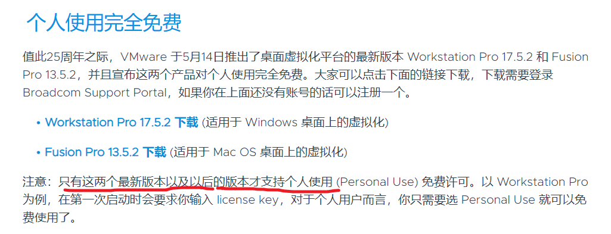
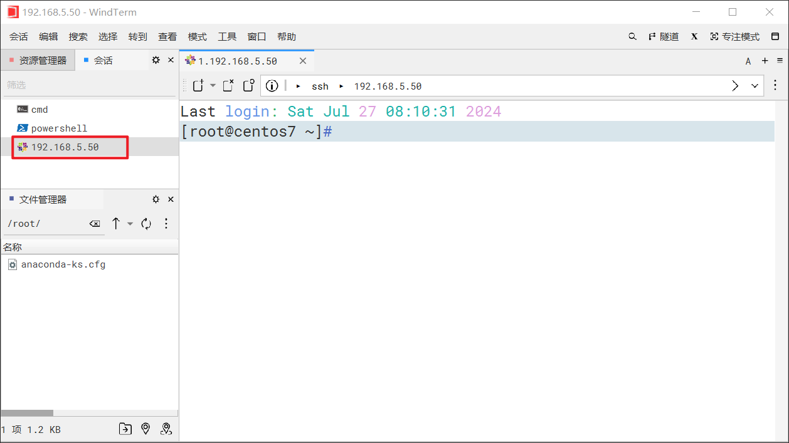
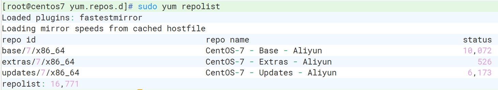

# 准备

## VMware



下载VMware

<video width="" height="" controls>
    <source src="./部署linux主机/下载VMware.mp4" type="video/mp4">
</video>


## CentOS 7.9

CentOS-7-x86_64-DVD-2009.iso

```html
<video width="" height="" controls>
    <source src="./部署linux主机/启动虚拟机.mp4" type="video/mp4">
</video>
```


# 创建虚拟机

<video width="" height="" controls>
    <source src="./部署linux主机/创建虚拟机.mp4" type="video/mp4">
</video>

# 启动虚拟机

<video width="" height="" controls>
    <source src="./部署linux主机/启动虚拟机.mp4" type="video/mp4">
</video>
# 配置centos7网络

## ens33

```shell
vi /etc/sysconfig/network-scripts/ifcfg-ens33
```

```bash
TYPE=Ethernet
PROXY_METHOD=none
BROWSER_ONLY=no
# BOOTPROTO=dhcp
BOOTPROTO=static   # 静态
DEFROUTE=yes
IPV4_FAILURE_FATAL=no
IPV6INIT=yes
IPV6_AUTOCONF=yes
IPV6_DEFROUTE=yes
IPV6_FAILURE_FATAL=no
IPV6_ADDR_GEN_MODE=stable-privacy
NAME=ens33
UUID=ab38c635-c25f-4118-b159-aaec28010169
DEVICE=ens33
# ONBOOT=no
ONBOOT=yes
IPADDR=192.168.5.50
GATEWAY=192.168.5.2
NETMASK=255.255.255.0
DNS1=114.114.114.114
DNS2=114.114.115.115
```

##　DNS

| 境内公共DNS |                 |                 |
| :---------- | --------------- | --------------- |
| 名称        | 首选地址        | 备选地址        |
| 114 DNS     | 114.114.114.114 | 114.114.115.115 |
| 阿里DNS     | 223.5.5.5       | 223.6.6.6       |
| 百度DNS     | 180.76.76.76    |                 |
| 腾讯DNS     | 119.29.29.29    | 182.254.116.116 |
|             |                 |                 |

| 境外公共DNS        |                |                |
| :----------------- | -------------- | -------------- |
| 名称               | 首选地址       | 备选地址       |
| Cloudflare & APNIC | 1.1.1.1        | 1.0.0.1        |
| 谷歌DNS            | 8.8.8.8        | 8.8.4.4        |
| OpenDNS            | 208.67.222.222 | 208.67.220.220 |
| 微软DNS            | 4.2.2.1        | 4.2.2.2        |
|                    |                |                |


## network

```shell
vi /etc/sysconfig/network
```

```bash
NETWORKING=yes
```


## 重启网络

```shell
service network restart
```

查看DNS


```shell
cat /etc/resolv.conf
```


## 关闭防火墙

临时关闭防火墙

```shell
systemctl stop firewalld
```

禁止防火墙开机自启

```shell
systemctl disable firewalld   
```


# 配置VMware网络

<video width="" height="" controls>
    <source src="./部署linux主机/配置VMware网络.mp4" type="video/mp4">
</video>
# 远程连接




# 修改yum镜像

可用镜像地址：https://mirrormanager.fedoraproject.org/mirrors/CentOS

## 备份CentOS-Base.repo

```shell
cp /etc/yum.repos.d/CentOS-Base.repo  /etc/yum.repos.d/CentOS-Base.repo.bk
```


##　修改CentOS-Base.repo

```shell
vi /etc/yum.repos.d/CentOS-Base.repo
```

```bash
[base]
name=CentOS-$releasever - Base - Aliyun
baseurl=https://mirrors.aliyun.com/centos/$releasever/os/$basearch/
gpgcheck=1
gpgkey=https://mirrors.aliyun.com/centos/$releasever/os/$basearch/RPM-GPG-KEY-CentOS-7

[updates]
name=CentOS-$releasever - Updates - Aliyun
baseurl=https://mirrors.aliyun.com/centos/$releasever/updates/$basearch/
gpgcheck=1
gpgkey=https://mirrors.aliyun.com/centos/$releasever/updates/$basearch/RPM-GPG-KEY-CentOS-7

[extras]
name=CentOS-$releasever - Extras - Aliyun
baseurl=https://mirrors.aliyun.com/centos/$releasever/extras/$basearch/
gpgcheck=1
gpgkey=https://mirrors.aliyun.com/centos/$releasever/extras/$basearch/RPM-GPG-KEY-CentOS-7
```


## 清除yum缓存


```shell
yum clean all 
```


## 更新yum缓存


```shell
yum makecache
```


## 测试新的镜像源


```shell
yum repolist
```




# 安装常用软件

```shell
yum install -y net-tools; # 网络工具的包，包括 ifconfig、netstat、route 等，用于网络配置和诊断
yum install -y rsync;  # 用于同步和备份文件和目录
yum install -y vim;    # 用于文本编辑器
yum install -y ntp;    # 用于同步计算机系统时间的服务
yum install -y unzip   # 用于解压缩
yum install -y tree   # 显示树形目录
```

